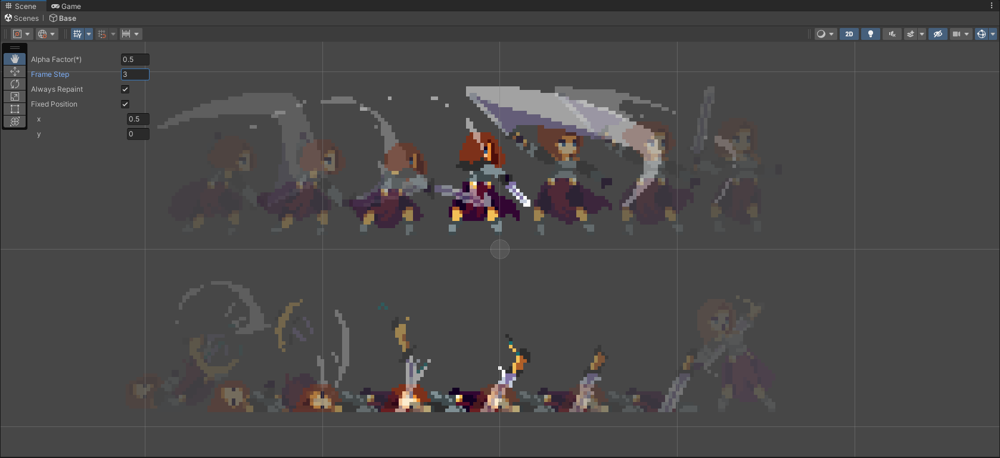

# Unity 2D Animation Onion Skin Effect

This repo contains two solutions to show the onion skin.

 - `OnionSkinWindow` registers a function `OnGUISceneView` with `SceneView.datingSceneGui` immediately after import.

   This function sets the selected object's to each frame in the range by setting it on each refresh. The screen is then intercepted. When finished, all frames intercepted are blended according to transparency and output to the screen.
 - `OnionSkinPreviewWindow` and `AnimationOnionStage` defines a new `AnimationOnionStage` to display the onion skin effect.

   In this Stage, a number of shadow objects are automatically generated. Each shadow object is set to a different frame and a different transparency.
 
   Compared to the previous method, this method allows you to drag the position of the shadows for easy viewing and comparison. And this method is more stable.

Animation Onion Stage:

## Usage

Just copy the Editor folder to your project.

If you want to remove `OnionSkinWindow.cs` (The first method), you need to delete the line of code that assigns `false` to `OnionSkinWindow.Enable` in `OnSceneGUI` in `AnimationOnionStage.cs`.

## References

- https://samuelarminana.com/index.php/2020/09/28/unity-editors-stages-and-scenes
- https://github.com/sapphire-al2o3/UnitySceneViewOnionSkin

## Assets

- https://assetstore.unity.com/packages/2d/characters/warrior-free-asset-195707
- https://assetstore.unity.com/packages/2d/characters/2d-character-sprite-animation-penguin-236747